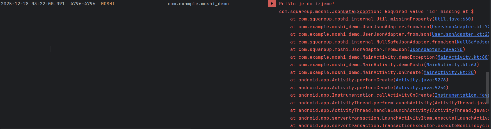

# Moshi – demonstracija uporabe JSON knjižnice
## Opis projekta

Ta projekt demonstrira uporabo knjižnice Moshi za serializacijo in deserializacijo objektov in JSON podatkov v Android aplikaciji (Kotlin)

Aplikacija prikazuje:

- pretvorbo JSON → Kotlin objekt,

- pretvorbo Kotlin objekta → JSON,

- uporabo anotacij,

- obravnavo napak (izjem),

- uporabo Moshi adapterjev.

Projekt je namenjen demonstraciji serializacije in deserializacije v Android okolju.

## Zakaj Moshi?

Moshi je sodobna JSON knjižnica, ki jo razvija Square (avtorji Retrofit-a) in je zasnovana kot nadgradnja starejših rešitev (npr. Gson).

### Prednosti:

-  Uradna podpora za Kotlin

- Podpora za data class

- Hitro delovanje

- Podpora za null-safety

- Enostavna integracija z Retrofit

- Majhna poraba pomnilnika

- Aktivno vzdrževana knjižnica

### Slabosti:

- Potrebuje dodatni kotlin-codegen za boljšo zmogljivost

- Manj fleksibilna kot Gson pri zelo dinamičnih JSON strukturah

- Manj razširjena kot Gson (a sodobnejša)

## Licenca

Moshi je objavljen pod Apache License 2.0, kar pomeni:

- dovoljena uporaba v komercialnih in odprtokodnih projektih,

- dovoljena sprememba kode,

- zahteva navedbo licence.

Licenca:
https://github.com/square/moshi/blob/master/LICENSE.txt

## Uporabniki in vzdrževanje

GitHub zvezdice: ~9.000+

Razvijalec: Square

Aktivno vzdrževanje: DA

Zadnja posodobitev: redno (večkrat letno)

Uporablja se v Retrofit in številnih Android aplikacijah

## Časovna in prostorska zahtevnost
- Časovna zahtevnost

Parsanje JSON -> O(n)
(n = velikost JSON podatkov)

- Prostorska zahtevnost

O(n) za shranjevanje objektov v pomnilniku

Majhna poraba pomnilnika v primerjavi z Gson

## Namen aplikacije

Aplikacija:

- prebere JSON niz,

- ga pretvori v Kotlin objekt,

- prikaže podatke na zaslonu,

- demonstrira napako pri napačnem JSON-u.

## Dodajanje Moshi v projekt
```kt
dependencies {
    implementation("com.squareup.moshi:moshi:1.15.0")
    implementation("com.squareup.moshi:moshi-kotlin:1.15.0")
    kapt("com.squareup.moshi:moshi-kotlin-codegen:1.15.0")
}
```

## Primer podatkovnega razreda
```kt
import com.squareup.moshi.Json
import com.squareup.moshi.JsonClass

@JsonClass(generateAdapter = true)
data class User(
    val id: Int,
    val name: String,
    val email: String,
    @Json(name = "is_active")
    val isActive: Boolean
)
```
## Primer uporabe Moshi
```kt
val moshi = Moshi.Builder().build()
val adapter = moshi.adapter(User::class.java)

val json = """
{
  "id": 1,
  "name": "Janez Novak",
  "email": "janez@example.com",
  "is_active": true
}
"""

val user = adapter.fromJson(json)
println(user)
```
## Izjeme

Če JSON ni pravilen:
```kt
val invalidJson = "{ name: 'Test' }"

try {
    val user = adapter.fromJson(invalidJson)
} catch (e: Exception) {
    Log.e("MoshiError", "Napaka pri parsiranju JSON-a", e)
}
```

Možne izjeme:

- JsonDataException

- IOException

- NullPointerException (če manjka obvezno polje)
